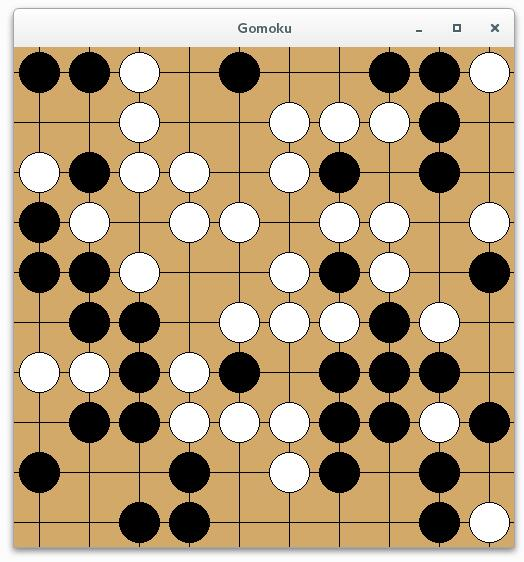

# AlphaGomoku
> Gomoku Game with AI



## Features
+ Reinforcement learning

## Dependencies
+ Python 3+
+ Numpy
+ H5py
+ PyQt5

## Status
Under development. Not all codes can run normally. May with some obscure bugs

## How to use
+ Install necessary dependencies (Linux)  
    ```pip install numpy h5py PyQt5```
+ Play with naive computer (Linux)  
    ```$ cd alphagomoku/test```  
    ```$ python playwithnaiveai.py```